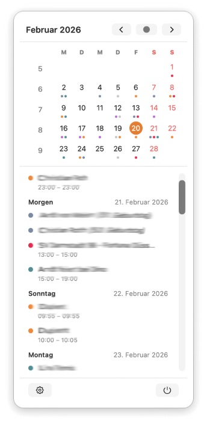

# MenuBarCalendar

A lightweight macOS menu bar app that shows a calendar and your upcoming events — always one click away.


---

## Features

- 📅 **Month calendar grid** — week starts on Monday, with ISO week numbers
- 🎯 **Today highlighted** with accent colour; selected day with outline
- 🔴 **Weekend dates** in red
- 🟢 **Event dots** per calendar colour (up to 3 per day)
- 📋 **Upcoming events list** — scrolls to current or next event automatically
- 🗓 **Opens Apple Calendar** on event tap
- ⚙️ **Settings** — select which calendars to show, toggle launch at login
- 🌍 **Localised** — English and German (follows system language)
- 🌙 **Midnight refresh** — icon and selected date always show today
- 🚀 **Launch at Login** support via `SMAppService`
- 🔒 No dock icon (`LSUIElement` / `NSApp.setActivationPolicy(.accessory)`)

---

## Screenshots



---

## Requirements

| | |
|---|---|
| macOS | 13.0 Ventura or later |
| Xcode | 15 or later |
| Swift | 5.9 or later |

---

## Installation

### Build from source

1. Clone the repository:
   ```bash
   git clone https://github.com/your-username/MenuBarCalendar.git
   cd MenuBarCalendar
   ```
2. Open `MenuBarCalendar.xcodeproj` in Xcode.
3. Select the `MenuBarCalendar` scheme and your Mac as the target.
4. Build and run (`⌘R`).

### Calendar permission

On first launch macOS will ask for **Calendar access**. You can also grant it manually in:

> System Settings → Privacy & Security → Calendars → MenuBarCalendar ✓

---

## Project structure

```
MenuBarCalendar/
├── AppDelegate.swift                    # App lifecycle, midnight icon timer, launch at login
├── CalendarManager.swift                # EventKit access, event fetching, calendar state
├── MenuBarCalendar.swift                # @main App entry point, MenuBarExtra
├── Views/
│   ├── CalendarView.swift               # Root view
│   ├── CalendarNavigationView.swift     # Month header + prev/today/next buttons
│   ├── CalendarGridView.swift           # Week grid with day cells
│   ├── DayCellView.swift                # Individual day cell
│   ├── WeekNumberView.swift             # ISO week number column
│   ├── EventDotsView.swift              # Coloured event dot indicators
│   ├── EventsListView.swift             # Scrollable upcoming events list
│   ├── DaySectionView.swift             # Day group header + event rows
│   ├── EventRowView.swift               # Single event row with time and video indicator
│   ├── NoAccessView.swift               # Shown when calendar access is denied
│   ├── EmptyEventsView.swift            # Shown when no upcoming events
│   └── CalendarToolBarView.swift        # Bottom bar (Settings / Quit)
├── Settings/
│   ├── SettingsView.swift               # Settings form
│   ├── CalendarsListView.swift          # Grouped calendar list
│   ├── CalendarSelectionView.swift      # Single calendar toggle row
│   └── SettingsRowView.swift            # Generic settings row with icon + chevron
├── en.lproj/Localizable.strings
└── de.lproj/Localizable.strings
```

---

## Localisation

The app ships with **English** and **German**. To add another language:

1. Add the language in Xcode → Project → Info → Localizations.
2. Duplicate `en.lproj/Localizable.strings` into the new `xx.lproj/` folder.
3. Translate the values.

---

## Privacy

MenuBarCalendar requests **read-only** access to your calendars (`NSCalendarsUsageDescription`). No data leaves your device.

---

## Credits

Inspired by [itsybitsycal](https://github.com/harryfliu/itsybitsycal) by [@harryfliu](https://github.com/harryfliu).

---

## License

GNU — see [LICENSE](LICENSE) for details.
